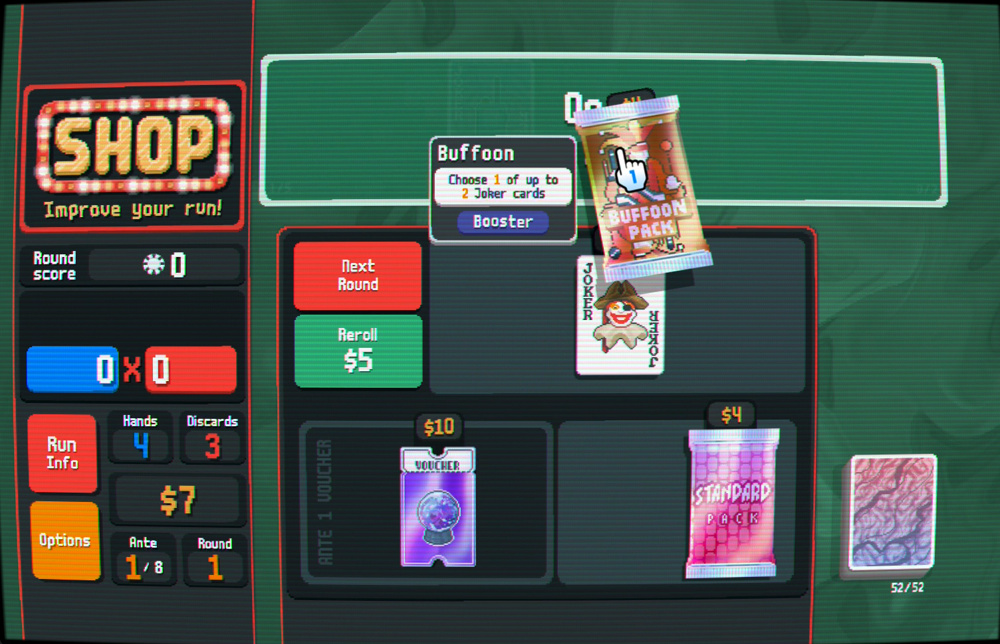

# "Touch" controls for Balatro PC/Mac

This Balatro mod injects the drag-and-drop interactions from the iOS port into the PC game, making it a bit more fun to play on desktop and improving the experience on Steam Deck!
The usual mouse controls are kept intact as well.

<small>Wiimote cursor from [https://primm.gay/extras/other/cursors/](https://primm.gay/extras/other/cursors/)</small>

# Compatibility

This mod has been tested against **Balatro 1.0.1o** (current patch as of February 26, 2025) on PC/Mac using code from the same patch on iOS. It has also been reported to work great on Steam Deck.

# Installation

0. This mod is made for [**Steammodded 1.x**](https://github.com/Steamodded/smods) and [lovely](https://github.com/ethangreen-dev/lovely-injector) so you will need to install them first [as explained here](https://github.com/Steamodded/smods/wiki).
1. Download the newest version of the mod from the [Releases tab](https://github.com/eramdam/balatro-mods/releases)
2. Extract the .zip file and move the `touch-mode` folder into your Mods file
3. Launch Balatro and enable the mod in the `Mods` panel
4. Enjoy dragging Jokers, Booster packs and consumables around!

## Disclaimer

This mod was made from code belonging to LocalThunk and Playstack Games. All I wish for this mod is for a future patch of Balatro to make it obsolete :)

## Background

This mod was written by comparing the iOS and PC codebases, generating a diff and using [lovely-differ](https://github.com/a-e-m/lovely-differ) to write a `lovely.toml` file. This is convenient given the scope of this mod, but might make contributing a bit tricky.
I obviously cannot re-distribute the PC/iOS source code, but I will be documenting my process soon, so people can replicate it and eventually contribute fixes/improvements.
